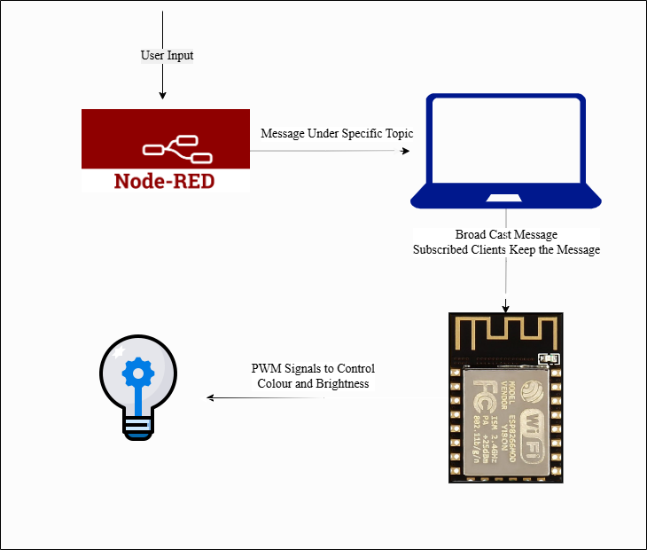
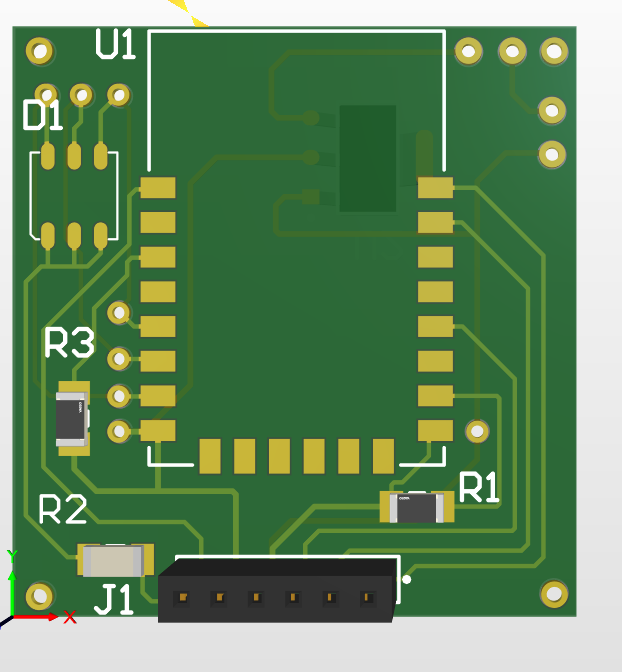
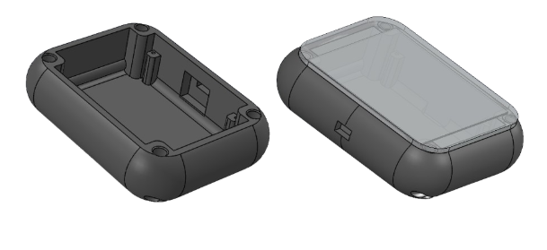
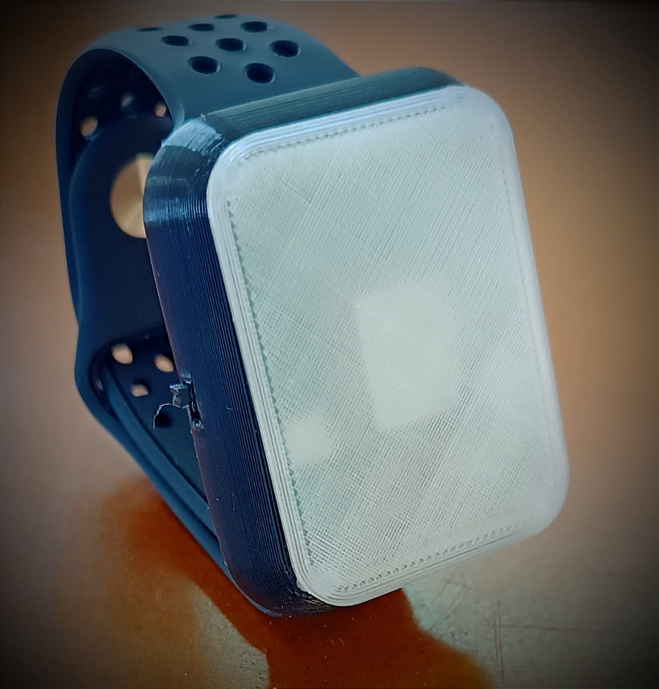
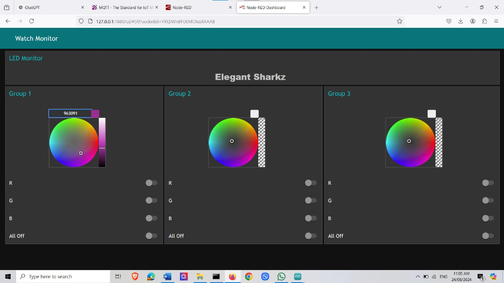

# Electronic-Wristband
🔋 **Project Overview**

A Coldplay-inspired smart wristband designed for live concerts and events. Our wristband synchronizes light effects via Wi‑Fi, creating immersive crowd experiences. This is the Semester 2 Engineering Design Project (EDP) developed using an ESP8266 NodeMCU and powered by a 3.7 V Li‑Po battery.

🗂️ **Product Architecture**

🎯 **Key Features**

Wi‑Fi Control: Synchronize LED patterns in real time across multiple bands.

Dual LEDs: High-brightness RGB LEDs supporting dynamic color and blink sequences.

Portable Power: 3.7 V Li‑Po battery with 4+ hours runtime.

Lightweight Design: Compact PCB and enclosure for comfort during events.

Open‑Source: Hardware schematics and firmware freely available.

⚡ **PCB**

A double layer PCB was designed to hold LEDs, MCU and distribute power.
The PCB was designed to be small enough to fit inside wristband.

📦 **Enclosure**

Enclosure was designed in SolidWorks and 3D printed. 

  
  

📈 **Dashboard**

Devices are controlled using a Node-RED dashboard. It can individually control the devices using MQTT protocol. The collour and brighness of wristbands can be changed using the dashboard.

